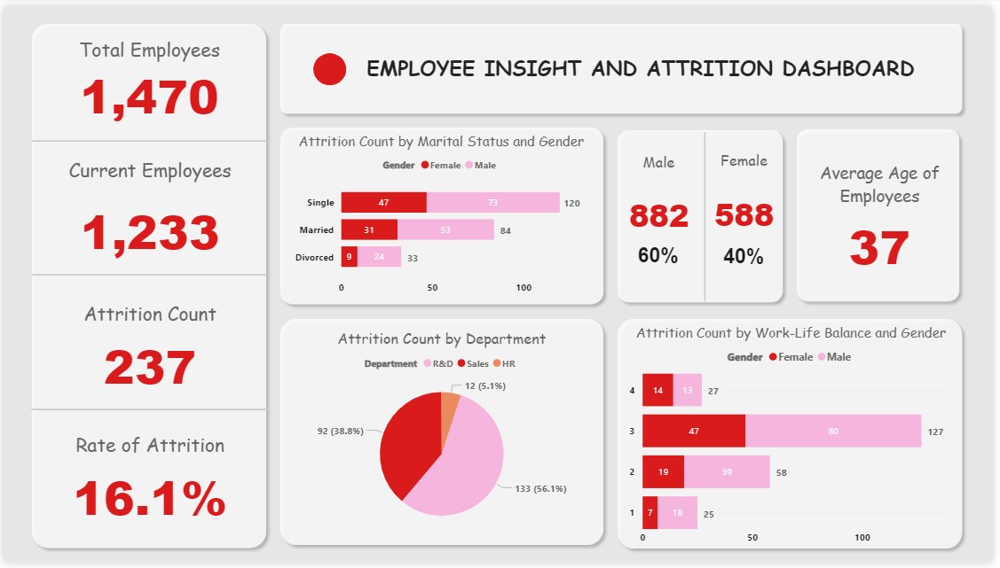
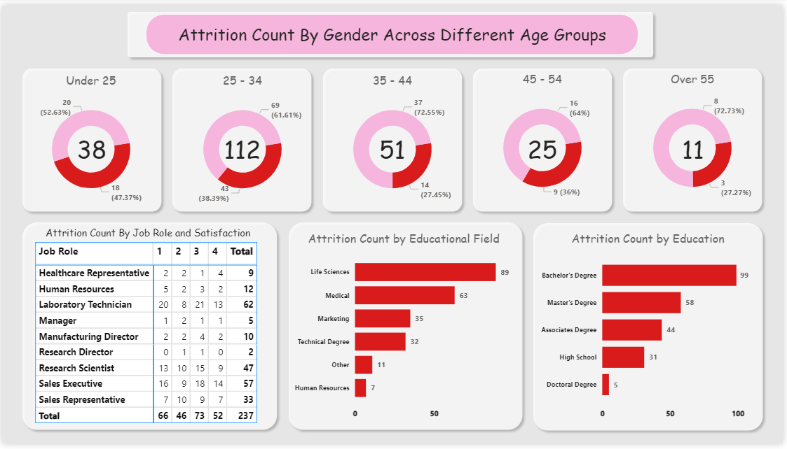

# 📊 HR-Attrition-Analysis
## Project Overview
This project focused on analyzing employee attrition trends within a mid-sized company of 1,470 employees. Using a cleaned HR dataset, I designed a comprehensive Power BI dashboard to identify key factors driving attrition, such as age, gender, job role, department, education, marital status, and work-life balance.
## 🚀 Project Objective
To analyze employee attrition and uncover potential factors influencing resignation, including:
- Department
- Gender
- Age
- Job satisfaction
- Marital status
- Work-life balance
- Education level and field
## 📎 Dataset Used
*This dataset was gotten from the DSA Data Analysis Training for project purposes.*
## 🛠 Tools and Technologies
Microsoft Power BI
- Data cleaning (handling missing values and correcting formats)
- Data visualization
## 📝 Key Features
- Cleaned and prepared raw HR data for analysis
- Designed clear and easy-to read charts to display insights and possible factors affecting attrition in the company
## 🎯 Detailed Breakdown of Key Insights
### 1. 📌 Overall Company Snapshot
- Total Employees: 1,470
- Current Employees: 1,233
- Attrition Count: 237
- Attrition Rate: 16.1% – This is relatively high and indicates a concern for HR to address.
### 2. 👤 Gender Distribution & Attrition
- Male Employees: 60%
- Female Employees: 40%
- Attrition Count by Gender:
  - Male: 153 (64.6%)
  - Female: 84 (35.4%)

*🔍 Insight: Although males make up more of the workforce, they also account for a higher portion of attrition. However, the difference closely mirrors the gender distribution, so no strong gender-based attrition trend stands out.* 
### 3. 🧪 Attrition by Department
- R&D: 133 (56.1%)
- Sales: 92 (38.8%)
- HR: 12 (5.1%)

*🔍 Insight: R&D has the highest attrition count. This may point to workload pressure, lack of growth opportunities, or role dissatisfaction in technical roles.*
### 4. 💼 Attrition by Job Role
- Top roles with high attrition:
  - Laboratory Technician: 62
  - Sales Executive: 57
  - Research Scientist: 47

*🔍 Insight: Technical and sales roles are the most affected. This could be due to performance pressure, unclear career paths, or lack of recognition.*
### 5. 📚 Attrition by Education Level
- Most Affected:
  - Bachelor’s Degree: 99
  - Master’s Degree: 58
  - Associate Degree: 44

*🔍 Insight: Employees with mid-level qualifications are leaving the most. The reasons might relate to expectations vs. reality, compensation gaps, or desire for upward mobility.*
### 6. 🎓 Attrition by Educational Field
- Top Fields:
  - Life Sciences: 89
  - Medical: 63
  - Marketing: 35

*🔍 Insight: Attrition is highest among employees with Life Science and Medical backgrounds—closely related to R&D and technical roles. There may be a need to assess work satisfaction in these domains.*
### 7. ❤️ Work-Life Balance & Gender
Majority of attrition cases came from employees rating work-life balance as 2 or 3 (out of 4).

*🔍 Insight: There’s a possible correlation between poor work-life balance and attrition. HR should consider flexible work options or workload reassessment.*
### 8. 👨‍👩‍👧‍👦 Attrition by Marital Status
- Single employees: 120
- Married: 84
- Divorced: 33

*🔍 Insight: Single employees are more likely to leave. This may relate to career mobility or lack of long-term commitment to the company.*
### 9. 👶👴 Attrition by Age Group
- Highest Attrition:
  - Age 25–34: 112
  - Under 25: 38

*🔍 Insight: Younger employees (under 35) are more likely to leave, possibly due to better opportunities, job-hopping, or dissatisfaction. A stronger retention plan for young talent is needed.*
### 10. 😊 Job Satisfaction Analysis
Most attrition occurred among employees with satisfaction scores of 2 or 3.

*🔍 Insight: Moderate to low satisfaction correlates with high attrition. Suggests the need for engagement programs and performance feedback systems.*
## 💡 Recommendations
- Deep-dive into R&D and Sales departments – Explore stress factors, career growth issues, or leadership gaps.
- Engage younger and single employees with mentorship, career path clarity, and flexible benefits.
- Improve work-life balance through remote options, wellness programs, or workload redistribution.
- Address dissatisfaction drivers by conducting stay interviews and anonymous surveys.
## Dashboard Preview

## ✅ Final Notes
This HR Attrition Analysis project provided valuable insights into employee turnover patterns using real-world organizational data. By leveraging Microsoft Power BI, I was able to visualize and interpret key trends affecting workforce stability — from departmental attrition spikes to the role of job satisfaction, education, and work-life balance.

Beyond building a visually compelling dashboard, this project helped strengthen my skills in data storytelling, business analysis, and interpreting human behavior through data. The insights generated can help HR departments make more informed decisions around employee retention, resource allocation, and organizational health.

This project reflects my ability to turn raw data into actionable insights — a key asset in any data-driven role.

*Authored By*: **Canaan Olanipekun**

*Date*: **July 2025**
